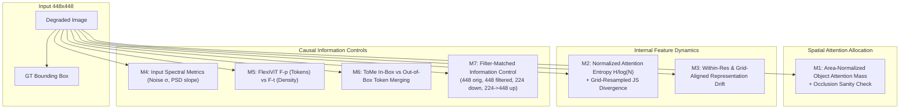
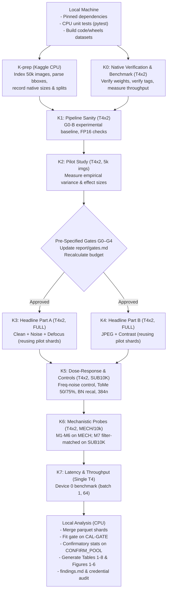

# Plan v2.2: Resolution as a Compute Knob Under Input Degradation
**Design Principle: Minimum compute, maximum scientific evidence.**
**Target Compute:** ~7.7 Device-Hours (~8.7 Device-Hours including 1.0h contingency; ~4.0–4.5 Wall-Clock Hours on T4×2; Hard Warning Threshold: >10.0 Device-Hours).

> [!IMPORTANT]
> **Scientific Validity Guardrails & Binding Rules**
> 1. **Precise Model Scope:** We evaluate the phenomenon across **three pretrained ImageNet-1K models spanning a CNN, fixed-patch ViT, and flexible-patch ViT** (`$n=1$` model per family). We do *not* claim generalization to "vision models" broadly.
> 2. **Strict Split Isolation & Reusability:** 
>    - `PILOT` (5,000 images): Frozen for pipeline verification, variance estimation, and pre-specified decision gates. Deterministic outputs are cached and directly reused in `FULL`.
>    - `CAL-GATE` (1,000 images): Disjoint calibration split used exclusively to tune zero-parameter spectral gate thresholds.
>    - `CONFIRM_POOL` (44,000 images): Strictly untouched during pilot tuning and gate fitting; reserved exclusively for confirmatory hypothesis testing.
>    - `FULL` (50,000 images): Descriptive summary tables and literature benchmark comparisons.
> 3. **Pre-Specified Decision Gates:** All gates are pre-specified and frozen prior to data inspection. No gate may alter the identity of the primary hypothesis.
> 4. **Experiment Expansion Rule:** *No optional experiment may be added merely because compute remains available. An experiment is added only when the pilot or reviewer-oriented analysis identifies a specific unresolved causal question that it can answer.*
> 5. **Identical Pairing:** All resolutions and models within a condition are evaluated on **the exact same images with identical corruption seeds** (`image_id, corruption, severity`).

---

## 1. Research Objective & Central Hypotheses

We investigate **when spending more inference pixels on a degraded image buys accuracy, and why**. Images arrive at a standard capture resolution (448×448). An inference system chooses how far to downsample prior to execution ($448 \to 384 \to 320 \to 224$).

### Research Questions
- **RQ1 (Resolution × Corruption Interaction):** Does the accuracy change from higher resolution, $\Delta(448 - 224)$, depend systematically on the corruption's frequency profile?
  - **H1a (Broadband Noise):** Downsampling attenuates high frequencies; higher resolution yields diminishing or negative returns relative to clean data.
  - **H1b (Defocus Blur):** The input is bandlimited; extra pixels carry negligible high-frequency information. $\Delta(448 - 224)$ shrinks significantly.
  - **H1c (Contrast Loss - Control):** Frequency-neutral global degradation; resolution scaling mirrors clean baseline behavior.
- **RQ2 (Mechanistic Drivers):** Is the observed resolution behavior driven by:
  - (i) Train-test resolution mismatch? *(Controlled via DeiT-384 native checkpoint & CNN BatchNorm recalibration)*
  - (ii) Spatial token count vs. patch/grid density? *(Evaluated via FlexiViT constant-patch vs. constant-grid arms)*
  - (iii) Input frequency content? *(Evaluated via filter-matched information control M7 and frequency-controlled noise)*
  - (iv) Spatial attention concentration? *(Quantified via area-normalized bounding-box attention mass and representation drift)*
- **RQ3 (Knob Selection at Matched Compute):** At equal compute budgets, does spatial downsampling outperform training-free token merging (ToMe at 448) within valid operating regimes? What is the empirical headroom of an input-dependent selector?

---

## 2. Dataset and Partition Taxonomy

Access is verified via Kaggle `imagenet-object-localization-challenge`:
- Validation images: `ILSVRC/Data/CLS-LOC/val/*.JPEG` (50,000 images).
- Ground-truth labels & bounding boxes: `LOC_val_solution.csv` (50,000 rows, 1,000 classes, mean 1.61 boxes/image).
- Synset mapping: `LOC_synset_mapping.txt` (alphabetical synset order, matching `timm`).
- Calibration: 2,000 training images from `ILSVRC/Data/CLS-LOC/train/` for label-free BatchNorm recalibration (`CALIB`).

### Partition Structure (Disjoint Stratified Subsets, Committed File Lists)

```
ImageNet Validation (50,000 images, 50/class)
├── PILOT (5,000 images, 5/class) ────────────► Pipeline verification & pre-specified gates (reused in FULL)
├── CAL-GATE (1,000 images, 1/class) ────────► Fit spectral gate thresholds ONLY
└── CONFIRM_POOL (44,000 images, 44/class) ──► STRICTLY UNTOUCHED during development & gate selection
    ├── PRIMARY_CONFIRM (34,000 images) ─────► Primary confirmatory hypothesis testing (T1)
    └── SUB10K (10,000 images, 10/class) ────► Dose-response (s1, s5), controls & mechanistic runs
        └── MECH (2,000 images) ─────────────► Grounded attention (M1-M3) & ToMe mechanisms (M6)
```
*Note: `FULL` (50,000 images = `PILOT` + `CAL-GATE` + `CONFIRM_POOL`) is reported in descriptive summary tables for standard literature benchmark comparisons.*

### Preprocessing & Corruption Protocol
1. Short-side resize to 512 (antialiased bilinear) $\to$ center crop 448×448 (fixed 0.875 crop ratio).
2. **Apply corruption directly in the 448×448 acquisition coordinate space** using standard `imagecorruptions` parameter definitions (unscaled physical corruption).
   - *Severity Definition:* Corruption severity is defined strictly by the parameter values in the 448 acquisition frame. Results are reported relative to this 448 frame and are *not* claimed to be directly interchangeable with published 224-pixel ImageNet-C benchmark scores.
3. Downsample the corrupted 448×448 image via antialiased bilinear interpolation to target evaluation resolutions $\{384, 320, 224\}$.
4. Map GT bounding boxes into the 448 crop coordinate frame and scale proportionally for spatial token masking.
5. Record source image native dimensions (`src_short_side`) to report stratified analyses on natively high-res vs. upsampled images.

---

## 3. Representative Architectures & Ladder

### Models
We select three pretrained ImageNet-1K models ($n=1$ per family):
1. **DeiT-B/16 (`deit_base_patch16_224.fb_in1k`):** Fixed-patch Vision Transformer (patch size 16×16; native resolution 224×224).
2. **EfficientNet-B3 (`efficientnet_b3.ra2_in1k`):** Compound-scaled CNN (native test resolution 320×320; sits inside our ladder).
3. **FlexiViT-B (`flexivit_base.1200ep_in1k`):** Transformer trained with randomized patch sizes (native: 240×240). Evaluated under two distinct arms:
   - **F-p (Constant Patch 16):** Patch size = 16 across resolutions $\implies$ variable token count (196, 400, 576, 784 tokens).
   - **F-t (Constant Grid 16×16):** Patch sizes $\{14, 20, 24, 28\}$ for resolutions $\{224, 320, 384, 448\} \implies$ constant 256 tokens.
   - *Interpretation:* Provides a controlled comparison between token count and patch/grid density while retaining possible differences in learned patch-embedding filtering. Supported patch sizes will be verified during K0.
4. **DeiT-B/16-384 (`deit_base_patch16_384.fb_in1k`) [Control]:** Same ViT recipe fine-tuned at 384×384 to explicitly isolate train-test resolution mismatch.

### Resolution Ladder
- **224×224:** ViT native resolution; base compute rung.
- **320×320:** EfficientNet-B3 native test resolution.
- **384×384:** DeiT-384 native resolution.
- **448×448:** Base acquisition resolution (unresampled).

---

## 4. Experiment Hierarchy & Matrix

### Classification of Experiments
- **CORE / PRIMARY:** DeiT-B, EfficientNet-B3, FlexiViT F-p; resolutions $\{224, 320, 384, 448\}$; clean + 4 corruptions @ severity 3; confirmatory evaluation on `CONFIRM_POOL`; Primary Family statistical inference.
- **CORE / MECHANISTIC:** FlexiViT F-t; DeiT native-384 control; EfficientNet BN control; area-normalized attention (M1); representation drift (M3); ToMe at validated compute budgets (~50%, ~75%); M7 filter-matched intervention (including 224$\to$448 control).
- **SECONDARY:** Severity 1 and severity 5 dose-response; frequency-controlled noise experiment; zero-parameter spectral gate & per-image oracle upper bound; hardware latency/throughput benchmarking.
- **DEFERRED:** CLIP, DINOv2, additional model architectures, 15-corruption expansion, exit-depth experiments, extensive hyperparameter sweeps.

### Corruptions Matrix
- **Gaussian Noise:** Broadband, high-frequency additive corruption.
- **Defocus Blur:** Low-pass filtering (bandlimited input).
- **JPEG Compression:** High-frequency 8×8 block artifacts at capture scale.
- **Contrast Loss:** Frequency-neutral baseline / negative control.

### Allocation Across Tiers
- **Tier 1 (Headline, FULL 50k = PILOT reused + PRIMARY_CONFIRM + CAL-GATE + SUB10K):** Clean + 4 corruptions @ Severity 3 $\times$ {V, F-p, F-t, E} across 4 resolutions. *(Confirmatory testing reported on `CONFIRM_POOL`).*
- **Tier 2 (Dose-Response, SUB10K):** 4 corruptions @ Severities 1, 5 $\times$ {V, F-p, F-t, E}.
- **Tier 3 (Controls, SUB10K):**
  - **Frequency-Controlled Noise Control:** Broadband noise injected at 448 vs. bandlimited noise generated at 224 and upsampled to 448, calibrated to matched RMS noise power.
  - **V-tome:** DeiT-B at 448 with ToMe merging evaluated at validated budgets (~50%, ~75%).
  - **V-384n:** DeiT-B-384 evaluated at 384 across conditions.
  - **E-bn:** EfficientNet-B3 with running BatchNorm statistics recalibrated on `CALIB` per resolution.
- **Tier 4 (Mechanisms, MECH 2k & SUB10K):** M1–M6 on `MECH`; M7 on `SUB10K`.

---

## 5. Pre-Specified Decision Gates (Evaluated on `PILOT`)

All gates are evaluated on `PILOT` (5,000 images) and frozen in `report/gates.md`.

### G0-A: Native Checkpoint Verification (Hard Gate)
- For each model, load official `pretrained_cfg` (expected native resolution, crop ratio, interpolation, normalization).
- Query official published accuracy from `timm` metadata dynamically at run time.
- Tolerance: Measured clean top-1 must fall within 2 standard errors of the published reference on 5k images ($\approx \pm 1.13$ percentage points for an 80% baseline).
- *Action:* Any failure halts execution immediately to resolve environment/weight discrepancies.

### G0-B: Experimental Pipeline Baseline (Descriptive Baseline)
- Separately evaluate models under the standardized research pipeline: 448 acquisition $\to$ downsample $\to$ target resolution.
- Report these numbers as experimental-pipeline baselines.
- *Explicit Rule:* **Native checkpoint verification and experimental-pipeline verification are different tests and are not interchangeable.**
- Retain a simple class-indexing sanity check (shuffled-label top-1 $\approx 0.1\%$).

### G1: Resolution Redundancy (CI-Based)
- An interior resolution (320 or 384) may be dropped from secondary runs only if:
  1. The 95% paired bootstrap CI of its deviation from log-FLOP linear interpolation lies entirely within $[-0.5, +0.5]$ percentage points across all models and conditions.
  2. Dropping it does not change the optimal resolution/knob ranking.
  3. The rung is **not** a model-specific native resolution (never drop 224, 448, EfficientNet native 320, or DeiT-384 native 384).

### G2: Central Interaction Testability
- Compute the pre-specified DiD and its pilot CI: $\text{DiD} = \Delta(448-224)_{\text{clean}} - \Delta(448-224)_{\text{noise, s3}}$.
- The pilot result determines only whether secondary experiments are trimmed or retained.
- The primary confirmatory DiD hypothesis remains unchanged regardless of whether the pilot CI excludes zero.
- TOST equivalence testing is a separately pre-specified secondary analysis and is not substituted for the primary hypothesis based on pilot results.

### G3: Secondary Scope Trimming (CI-Based Negligible-Effect Rules)
- **E-bn:** Omit E-bn from Tier 2 if the 95% CI of $(\text{Acc}_{\text{recal}} - \text{Acc}_{\text{vanilla}})$ lies entirely inside $[-0.3, +0.3]$ pp across all pilot conditions.
- **Severity 1:** Omit Severity 1 from Tier 2 if the 95% CI of $(\text{Acc}_{\text{s1}} - \text{Acc}_{\text{clean}})$ lies entirely inside $[-0.5, +0.5]$ pp across all models.

### G4: Budget Realignment
- Re-project remaining project budget using empirical throughput measured in K0/K2.
- If projected total exceeds 9.0 Device-Hours, apply pre-specified scope reductions (G1 redundancy drop $\to$ G3 secondary trimming).
- If projected total exceeds 10.0 Device-Hours, **halt and report to user**.

---

## 6. Redesigned ToMe Comparison (Operating Regimes)

To prevent pathological comparisons, ToMe is evaluated only within validated, stable operating regimes:
- **Primary Matched Targets:**
  - **~50% Compute Budget:** Achieved via valid constant-$r$ merging schedule. Specify exact schedule, record token count by layer, and measure achieved GFLOPs.
  - **~75% Compute Budget:** Evaluated if practically achievable with a stable schedule.
- **25% Budget (Exploratory Only):**
  - Retain strictly as an exploratory probe. If ToMe cannot reach ~22–25% equivalent FLOPs without token collapse or departing from its validated operating regime, do not force an extreme schedule.
  - Label explicitly: *"Outside validated ToMe operating range."*
  - Do not present pathological 25% ToMe performance as evidence that downsampling is intrinsically superior.

---

## 7. Mechanistic Analysis Framework (M1–M7)

Executed on `MECH` (2,000 images with clean GT boxes) and `SUB10K`:



- **M1: Area-Normalized Object Attention Mass:**
  $$\text{NormMass} = \frac{\text{Attention Mass inside GT Box}}{\text{GT Box Area Fraction}}$$
  Computed for last-layer CLS attention / rollout (ViTs) and Grad-CAM energy (EfficientNet). Includes a cheap occlusion sanity check on a subset (mask inside-box vs. outside-box) to confirm that attention correlates with model prediction reliance.
- **M2: Normalized Attention Entropy & Grid-Resampled Divergence:**
  Compute normalized entropy $H_{\text{norm}} = H / \log(N)$ to enable valid comparisons across token counts $N \in \{196, 400, 576, 784\}$. Resample attention maps to a common spatial grid prior to computing Jensen-Shannon divergence across resolutions.
- **M3: Within-Resolution & Aligned Representation Drift:**
  Measure within-resolution representation perturbation $\frac{\|h_{\text{corr}} - h_{\text{clean}}\|_2}{\|h_{\text{clean}}\|_2}$ across layers. Cross-resolution drift is evaluated on CLS embeddings or spatial feature maps resampled to a common coordinate grid.
- **M4: Input Spectral Characterization:**
  Radial PSD slope and Immerkaer noise $\sigma$ measured directly from input tensors to link physical degradation to representation drift.
- **M5: Token Count vs. Grid Density (FlexiViT Contrast):**
  Direct comparison of F-p (variable tokens) vs. F-t (constant 256 tokens) across resolutions under identical weights.
- **M6: ToMe Foreground vs. Background Merging Dynamics:**
  Quantify whether ToMe preferentially merges background vs. foreground tokens under noise, and compare cluster size distributions.
- **M7: Filter-Matched Information Control:**
  Tied directly to the actual resize/antialiasing filter (e.g. PyTorch antialiased bilinear triangle filter). Evaluates four conditions on `SUB10K`:
  - **A:** Original 448 input (784 tokens).
  - **B:** 448 input + exact antialiasing low-pass filter associated with 448$\to$224 resize, **without decimation** (784 tokens).
  - **C:** Actual 224 downsampled input (196 tokens).
  - **D:** 224 input upsampled back to 448 (784 tokens).
  - *Interpretive Standard:* If B mirrors C rather than A, the result is described as *"consistent with a frequency-content explanation"* rather than *"causally proven"*.

---

## 8. Statistical Inference & Multiplicity Control

Executed on `CONFIRM_POOL` (44,000 images, strictly isolated from pilot decisions):

### Scales of Analysis
- **Primary Interpretive Scale:** Percentage point (pp) accuracy differences $\Delta\text{Acc}$, chosen for direct operational interpretability in compute-accuracy trade-offs.
- **Sensitivity Scale:** Logistic odds ratios / logit-scale coefficients evaluated via Generalized Estimating Equations (GEE) with image-clustered standard errors.

### Multiplicity Control & Pre-Specified Families
- **Primary Family ($m=12$ tests):**
  - 3 primary configurations: DeiT-B, EfficientNet-B3, FlexiViT F-p.
  - 4 corruption types: Gaussian noise, defocus blur, JPEG compression, contrast loss.
  - Evaluated on Difference-in-Differences: $\text{DiD} = \Delta(448-224)_{\text{clean}} - \Delta(448-224)_{\text{corr}}$.
  - Multiplicity control: **Holm-Bonferroni correction** applied across the 12 tests.
- **Secondary Family:** FlexiViT F-t, ToMe, native-resolution controls (DeiT-384, E-bn), and selector analyses. Holm correction applied within this secondary family.
- **Equivalence Family (Separate):** Two One-Sided Tests (TOST) evaluated against a pre-specified margin of $\pm 0.5$ pp.
  - *Justification:* The $\pm 0.5$ pp margin represents a practically negligible accuracy difference and is formally evaluated against paired-disagreement variance estimated in K2.

### Secondary Robustness
- Pairwise resolution comparisons evaluated via exact McNemar's tests.
- Logistic GEE with image-level clustering for correlated binary outcomes.
- Optional GLMM on `SUB10K` subset for exploratory hierarchical modeling.

---

## 9. Selector Data Split & Headroom Analysis

To prevent data leakage, selector thresholds are fitted strictly on `CAL-GATE`:
1. **Calibration:** Fit zero-parameter spectral gate thresholds on `CAL-GATE` (1,000 images).
2. **Freeze:** Freeze gate thresholds prior to evaluating test data.
3. **Evaluation:** Evaluate frozen gate on `CONFIRM_POOL`.

### Headroom Benchmark Definitions
- **Fixed-Resolution Baseline:** Best single fixed resolution chosen on `CAL-GATE`.
- **Zero-Parameter Spectral Gate:** Input-dependent threshold selector based on noise $\sigma$ and blur metrics.
- **Condition-Level Oracle:** Best average resolution per (corruption, severity) condition.
- **Per-Image Oracle Upper Bound:** Best resolution selected per individual image.
  - *Label:* Explicitly designated as an **optimistic upper bound, not a deployable method**.

---

## 10. Hardware Budget, Units & Execution Strategy

### Definition of Compute Units
1. **Wall-Clock Hours:** Actual elapsed Kaggle kernel execution time.
2. **Device-Hours:** $\text{Wall-Clock Hours} \times \text{Number of Active GPUs}$. *(Primary Scientific Budget Unit)*.
3. **Kaggle Quota Hours:** Actual platform quota consumed, verified against Kaggle account metrics in K0.
   - *Scaling Principle:* Parallel execution on T4×2 may reduce wall-clock time for independent workloads that efficiently saturate both GPUs; actual scaling will be measured during K0/K2.

### Mandatory Compute Optimizations
- **Pilot Shard Reuse:** The 5,000 images evaluated in `PILOT` are cached and directly merged into `FULL` for identical model/condition/seed configurations. They are not re-executed.
- **Shared Corruption Tensors:** Each deterministic corruption condition is decoded, cropped, and corrupted once at 448 per batch, then shared across all models evaluated on that condition.
- **Shared Batch Execution:** Models share input tensors in GPU memory where memory allows.
- **Offline CPU Analysis:** All statistics, bootstrap CIs, GLMMs, figures, and gate fitting are executed locally on CPU (0 GPU hours).

### Detailed Compute Budget (Mathematically Verified)

| Job ID & Component | Wall-Clock (h) | Active GPUs | Device-Hours | Quota Est. (h) | Scope & Key Optimizations |
|---|---|---|---|---|---|
| **K-prep: Data Indexing & Bbox Mapping** | 0.20 | 0 (CPU) | **0.00** | 0.00 | CPU Kaggle kernel / Local |
| **K0: Native Checkpoint & Benchmark** | 0.20 | 2 (T4×2) | **0.40** | 0.20–0.40 | G0-A native verification, measure actual img/s |
| **K1: Sanity Tests & Pipeline Baselines** | 0.15 | 2 (T4×2) | **0.30** | 0.15–0.30 | G0-B pipeline tests, FP16 checks, ToMe $r=0$ |
| **K2: Pilot Study (5k Images)** | 0.45 | 2 (T4×2) | **0.90** | 0.45–0.90 | 9 conditions + controls; shards cached for FULL |
| **K3: Tier 1 Headline Part A (FULL)** | 1.10 | 2 (T4×2) | **2.20** | 1.10–2.20 | Clean + Noise + Defocus; 45k new imgs (5k reused) |
| **K4: Tier 1 Headline Part B (FULL)** | 0.85 | 2 (T4×2) | **1.70** | 0.85–1.70 | JPEG + Contrast; 45k new imgs (5k reused) |
| **K5: Tier 2 Dose-Response & Controls (SUB10K)**| 0.60 | 2 (T4×2) | **1.20** | 0.60–1.20 | Severities 1, 5, freq-noise, ToMe, BN-recal, 384n |
| **K6: Tier 4 Mechanisms & Low-Pass (MECH/10k)**| 0.40 | 2 (T4×2) | **0.80** | 0.40–0.80 | M1–M6 on MECH (2k); M7 on SUB10K |
| **K7: Latency & Throughput Benchmark** | 0.20 | 1 (Single T4)| **0.20** | 0.20 | Formal timing on Device 0 only (batch 1, 64) |
| **Local CPU Analysis & Paper Outputs** | 2.00 | 0 (CPU) | **0.00** | 0.00 | All bootstrap stats, GEE, tables, figures |
| **Subtotal (Excluding Contingency)** | **3.95** | — | **7.70** | **3.75–7.70** | *Comfortably inside the 7–9 Device-Hour target* |
| **Contingency Buffer (Reserved)** | 0.50 | 2 (T4×2) | **1.00** | 0.50–1.00 | Platform retries, preemptions, reruns |
| **Total Projected Budget** | **4.45 h** | — | **8.70 h** | **4.25–8.70 h** | *Target: ~7.7h; Range: 7.2–9.6 Device-Hours* |

*Note: Quota depends on whether Kaggle bills T4×2 at 1× or 2× wall-clock; under either policy, total quota consumed is $\le 8.70$ hours, well below the 30-hour weekly quota.*

---

## 11. Kaggle Execution Workflow



### Reproducibility & Safety Protocol
- **Weight Verification:** K0 verifies `timm` weight checksums against official hashes. Pinned fallback weights are staged in private Kaggle dataset `knobs-weights`.
- **Run Metadata:** Every kernel exports `run_meta.json` logging: git commit hash, model tags, weight hashes, package versions (`torch`, `timm`, `CUDA`), driver version, GPU hardware ID, and dataset split hashes.
- **Resumability:** Shards are saved as Parquet after each batch. If a session times out, the runner skips completed shards upon restart.
- **Credential Hygiene:** No credentials or tokens exist in code datasets, notebooks, or logs. Local environment variables authenticate pushes.

---

## 12. Deliverables for the Paper

### Tables
1. **Table 1 (Native Checkpoint Verification - G0-A):** Official reference accuracy vs. measured native accuracy on 5k images.
2. **Table 2 (Experimental-Pipeline Clean Baseline - G0-B):** Clean accuracy across all 4 resolutions under the 448 acquisition pipeline on `FULL` (50k).
3. **Table 3 (Headline Resolution × Corruption Effects):** Primary resolution effect $\Delta(448-224)$ across models and corruptions at Severity 3 on `CONFIRM_POOL`, with paired bootstrap 95% CIs and Holm-adjusted $p$-values.
4. **Table 4 (Resolution Mismatch Controls):** DeiT-384 native vs. DeiT-224@384; EfficientNet vanilla vs. BN-recalibrated (`E-bn`).
5. **Table 5 (Matched-Compute Downsampling vs. ToMe):** Accuracy vs. measured GFLOPs comparing spatial downsampling against ToMe at validated compute budgets (~50%, ~75%, exploratory ~25%).
6. **Table 6 (Mechanistic Summary):** Area-normalized object attention mass (M1), representation drift (M3), and low-pass information control (M7).
7. **Table 7 (Selector Headroom & Oracle Upper Bound):** Fixed resolution vs. zero-parameter spectral gate (fit on `CAL-GATE`) vs. condition oracle vs. per-image oracle upper bound.
8. **Table 8 (Hardware Efficiency on T4):** Measured latency (batch 1, 64) and throughput (img/s) across configurations.

### Figures
1. **Figure 1 (Resolution Scaling Curves):** Top-1 accuracy vs. resolution across corruption types and severities.
2. **Figure 2 (Accuracy vs. Measured GFLOPs Pareto):** Downsampling Pareto frontiers vs. ToMe configurations.
3. **Figure 3 (Area-Normalized Object Attention Mass):** Attention concentration in GT bounding boxes across resolutions under clean vs. degraded inputs.
4. **Figure 4 (FlexiViT Token Count vs. Grid Density):** Head-to-head comparison of F-p (variable tokens) vs. F-t (constant tokens) across resolutions.
5. **Figure 5 (Filter-Matched Information Control M7):** Accuracy across 448 original, 448 low-pass filtered, 224 downsampled, and 224$\to$448 upsampled inputs.
6. **Figure 6 (Selector Headroom Frontier):** Accuracy-vs-FLOPs curves comparing fixed choices, the spectral gate, and the per-image oracle upper bound.

---

## 13. Verification Checklist Prior to K0

- [x] Budget numbers mathematically verified and sum exactly.
- [x] Budget units explicitly defined (Wall-Clock, Device-Hours, Quota).
- [x] Primary testing family matches the stated multiplicity structure ($m=12$).
- [x] Pilot and confirmatory data partitions completely isolated (`PILOT`, `CAL-GATE`, `CONFIRM_POOL`).
- [x] Pre-specified decision gates do not alter the primary hypothesis identity.
- [x] G0 split into native checkpoint verification (G0-A) and experimental pipeline baseline (G0-B).
- [x] ToMe redesigned around validated operating regimes (~50%, ~75%) with 25% marked exploratory.
- [x] M7 derived from actual antialiased resize-filter kernel, including 224$\to$448 control.
- [x] Normalized attention entropy ($H / \log N$) and common-grid representation alignment specified.
- [x] Selector thresholds fitted strictly on `CAL-GATE`.
- [x] Per-image oracle explicitly defined as an optimistic upper bound.
- [x] Frequency-controlled noise control explicitly added to address causal ambiguity.
- [x] Physical corruption defined in 448 acquisition frame without resolution scaling.
